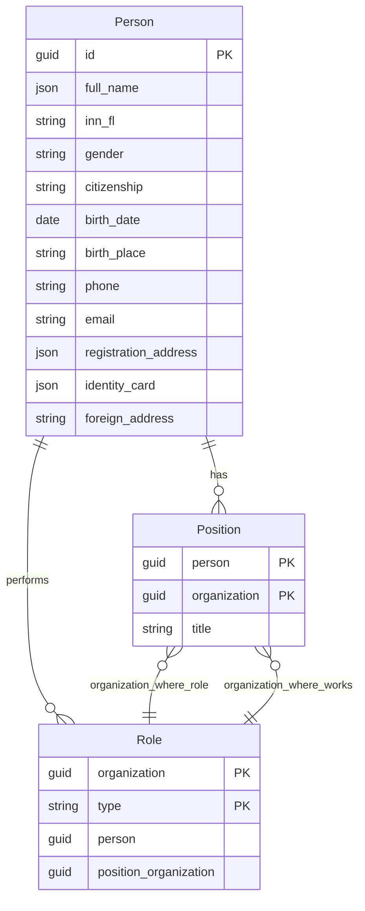

# Employee
Техническая документация сервиса для работы с реквизитами сотрудников

## Оглавление
- [1. Общие сведения](#1-общие-сведения)
- [2. Контуры (окружения)](#2-контуры-окружения)
  - [2.1. Тест](#21-тест)
  - [2.2. Прод](#22-прод)
- [3. Старт работы](#3-старт-работы)
  - [3.1. Подключение через клиента](#31-подключение-через-клиента)
  - [3.2. Подключение через REST API](#32-подключение-через-rest-api)
    - [3.2.1. Способ авторизации](#321-способ-авторизации)
  - [3.3. Ограничения](#33-ограничения)
    - [3.3.1. RPS](#331-rps)
    - [3.3.2. Иные ограничения](#332-иные-ограничения)
- [4. Структура хранилища данных](#4-структура-хранилища-данных)
  - [4.1. Сущности сервиса](#41-сущности-сервиса)
  - [4.2. Описание данных](#42-описание-данных)
    - [4.2.1. Сущности](#421-сущности)
      - [4.2.1.1. Сущность Person](#4211-сущность-person)
      - [4.2.1.2. Сущность Position](#4212-сущность-position)
      - [4.2.1.3. Сущность Role](#4213-сущность-role)
  - [4.3. ER-диаграмма](#43-er-диаграмма)
- [5. Описание API](#5-описание-api)
  - [5.1. Ссылка на Swagger](#51-ссылка-на-swagger)
  - [5.2. SDK](#52-sdk)
- [6. Контакты и поддержка](#6-контакты-и-поддержка)

## 1. Общие сведения
 
**Employee** — внутренний сервис для работы с реквизитами сотрудников. 

Все реквизиты хранятся централизованно. Благодаря этому актуальные данные доступны для всех организаций, к которым относится сотрудник.

Сервис поддерживает **два способа работы**:
* через клиента,
* через REST API.

## 2. Контуры (окружения)
> ⚠️ **Раздел в разработке**  
> Для полного заполнения этого раздела требуется дополнительная информация.

### 2.1 Тест

**Для интеграционного тестирования и отладки**

| Параметр | Значение | Описание |
|----------|----------|----------|
| **Базовый URL API** | *указать* | Основной эндпоинт |
| **Аутентификация** | *указать* | [Подробнее в разделе "Аутентификация"]() |
| **Лимиты** | *указать* | Ограничение на количество запросов в минуту |
| **Частота перезаписи данных** | *указать* | Частота обновления тестовой БД |

**Данные для тестирования:**

---

### 2.2 Прод

**Для рабочей эксплуатации**

| Параметр | Значение | Описание |
|----------|----------|----------|
| **Базовый URL API** | *указать*| Продовский эндпоинт |
| **Аутентификация** | *указать* | [Подробнее в разделе "Аутентификация"]() |
| **Лимиты** |*указать* | Ограничение на количество запросов в минуту |
| **SLA** |*указать* | Обслуживание |

---

## 3. Старт работы
> ⚠️ **Раздел в разработке**  
> Для полного заполнения этого раздела требуется дополнительная информация.

### 3.1 Подключение через клиента
### 3.2 Подключение через REST API
#### 3.2.1 Способ получения доступов
#### 3.2.2 Способ авторизации
### 3.3 Ограничения
#### 3.3.1 RPS
#### 3.3.2 Иные ограничения

---

## 4. Структура хранилища данных
### 4.1 Сущности сервиса
Сущности сервиса используются для формирования:
* отчётов,
* СОПов (добавить расшифровку).
### 4.2 Описание данных
#### 4.2.1 Сущности

---

##### 4.2.1.1 Сущность Person
Сущность содержит персональные данные сотрудника. Каждая запись представляет собой уникального сотрудника в системе с полным набором реквизитов: ФИО, паспортные данные, контактная информация, адреса. 
| Поле | Обязательность | Тип | Формат | Пример | Описание |
|------|----------------|-----|---------|---------|-----------|
| Guid | Да | guid | UUID | `"a1b2c3d4-e5f6-7890-abcd-ef1234567890"` | Уникальный идентификатор должности |
| FullName | Да | object | JSON | `{"LastName":"Иванов","FirstName":"Иван","MiddleName":"Иванович"}` | ФИО сотрудника |
| InnFl | Нет | string | 12 цифр | `"771122334455"` | ИНН физического лица |
| Gender | Нет | string | "Male"/"Female" | `"Male"` | Пол |
| Citizenship | Нет | string | Код страны ISO 3166 | `"RU"` | Гражданство |
| BirthDate | Нет | date | ГГГГ-ММ-ДД | `"1985-03-15"` | Дата рождения |
| BirthPlace | Нет | string | Текст | `"г. Москва"` | Место рождения |
| Phone | Нет | string | Международный формат | `"+79991234567"` | Телефон |
| Email | Нет | string | Email | `"ivanov@example.com"` | Email |
| RegistrationAddress | Нет | object | JSON | `{"PostalCode":"123456","Region":"Москва"}` | Адрес регистрации |
| IdentityCard | Нет | object | JSON | `{"Type":"Passport","Series":"4510","Number":"123456"}` | Удостоверение личности |
| ForeignAddress | Нет | string | Текст | `"Germany, Berlin"` | Адрес за границей |

---

##### 4.2.1.2 Сущность Position
Определяет принадлежность сотрудника к организации и его должность. Один сотрудник может иметь несколько должностей в разных организациях. 
| Поле | Обязательность | Тип | Формат | Пример | Описание |
|------|----------------|-----|---------|---------|-----------|
| Person | Да | guid | UUID | `"a1b2c3d4-e5f6-7890-abcd-ef1234567890"` | Уникальный идентификатор сотрудника |
| Organization | Да | guid | UUID | `"b2c3d4e5-f6g7-8901-bcde-f23456789012"` | Уникальный идентификатор организации |
| Title | Да | string | Текст | `"Старший программист"` | Название должности сотрудника в организации |

---

##### 4.2.1.3 Сущность Role
Определяет, какие роли есть у сотрудника в компании. Например, кто является руководителем или главным бухгалтером. Сотрудник может работать в одной компании, а роль выполнять в другой.
| Поле | Обязательность | Тип | Формат | Пример | Описание |
|------|----------------|-----|---------|---------|-----------|
| Organization | Да | guid | UUID | `"b2c3d4e5-f6g7-8901-bcde-f23456789012"` | Организация, где работает сотрудник|
| Type | Да | string | Enum: Руководитель, Главный бухгалтер, Отправитель, ИП | `"Руководитель"` | Тип функциональной роли |
| Person | Да | guid | UUID | `"a1b2c3d4-e5f6-7890-abcd-ef1234567890"` | Сотрудник, выполняющий роль |
| PositionOrganization | Да | guid | UUID | `"c3d4e5f6-g7h8-9012-cdef-345678901234"` | Организация, где выполняется роль |

### 4.2 ER-диаграмма

## 5 Описание API
> ⚠️ **Раздел в разработке**  
> Для полного заполнения этого раздела требуется дополнительная информация.
### 5.1 Swagger
С документацией API Employee можно ознакомиться по [ссылке]()
### 5.2 SDK

## 6 Контакты
> ⚠️ **Раздел в разработке**  
> Для полного заполнения этого раздела требуется дополнительная информация.

| Вопрос | К кому обращаться | Контакты | Примечания |
|--------|-------------------|----------|------------|
| **Доступы/подключение** | *указать*| *указать*| Запрос доступа к тестовому и продовому контурам |
| **API/ошибки в запросах/баги** |*указать* | *указать*| Описание ошибки, пример запроса, логи |
| **Инциденты** |*указать*  | *указать*| Срочные вопросы по недоступности сервиса |
| **Доработки** | *указать* | *указать*| Предложения по новому функционалу |
| **Общие вопросы по документации** | *указать*| *указать*| Уточнения и дополнения документации |

