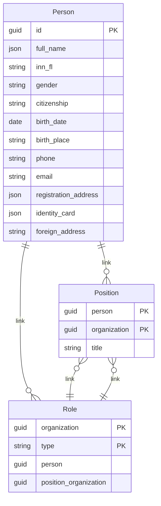

# Employee
Техническая документация сервиса для работы с реквизитами сотрудников

> ⚠️ **Документация в разработке**  

## Оглавление
- [1. Общие сведения](#1-общие-сведения)
- [2. Контуры (окружения)](#2-контуры-окружения)
  - [2.1. Тест](#21-тест)
  - [2.2. Прод](#22-прод)
- [3. Старт работы](#3-старт-работы)
  - [3.1. Подключение через клиента](#31-подключение-через-клиента)
  - [3.2. Подключение через REST API](#32-подключение-через-rest-api)
    - [3.2.1. Способ авторизации](#321-способ-авторизации)
  - [3.3. Ограничения](#33-ограничения)
    - [3.3.1. RPS](#331-rps)
    - [3.3.2. Иные ограничения](#332-иные-ограничения)
- [4. Структура хранилища данных](#4-структура-хранилища-данных)
  - [4.1. Сущности сервиса](#41-сущности-сервиса)
  - [4.2. Описание данных](#42-описание-данных)
    - [4.2.1. Сущности](#421-сущности)
      - [4.2.1.1. Сущность Person](#4211-сущность-person)
      - [4.2.1.2. Сущность Position](#4212-сущность-position)
      - [4.2.1.3. Сущность Role](#4213-сущность-role)
  - [4.3. ER-диаграмма](#43-er-диаграмма)
- [5. Описание API](#5-описание-api)
  - [5.1. Ссылка на Swagger](#51-ссылка-на-swagger)
  - [5.2. SDK](#52-sdk)
- [6. Контакты и поддержка](#6-контакты-и-поддержка)

## 1. Общие сведения
 
**Employee** — внутренний сервис для работы с реквизитами сотрудников. 

Все реквизиты хранятся централизованно. Благодаря этому актуальные данные доступны для всех организаций, к которым относится сотрудник.

**Проблема, которую решает сервис:**
Раньше данные сотрудников хранились отдельно в каждой организации пользователя. Если сотрудник работал в нескольких организациях, его реквизиты дублировались. При изменении данных (например, смене фамилии) приходилось вручную обновлять информацию во всех организациях.

**Как это работает сейчас:**
- Изменили данные сотрудника один раз — изменения автоматически применились ко всем его организациям.
- Данные хранятся централизованно, без дублирования в разных системах.
- Все сервисы продукта работают с актуальными данными из одного источника.

### С помощью сервиса можно:

**управлять карточками сотрудников**:
*   **добавлять** новых сотрудников в систему,
*   **находить** сотрудников по разным критериям (поиск и фильтры),
*   **смотреть** полную информацию о любом сотруднике,
*   **менять** данные сотрудника (например, фамилию или должность) — изменения автоматически применяюся ко всем связанным организациям,
*   **удалять** сотрудников из системы.

**управлять ролями и доступом**
*   **назначать** роли сотрудникам в разных организациях,
*   **смотреть** какие роли есть у сотрудника,
*   **проверять** все роли в конкретной организации,
*   **отзывать** роли (по одной или сразу все в организации).

**работать с должностями**
*   **создавать** и **обновлять** должности сотрудников,
*   **видеть**, кто и какую должность занимает.

---

## 2. Контуры (окружения)

### 2.1 Тестовый контур

<details>
<summary>Раскрыть >>></summary>

| Параметр | Значение | Описание |
|----------|----------|----------|
| **Базовый URL API** | http://test.kontur.ru:80/api | Тестовый эндпоинт |
| **Аутентификация** | OAuth 2.0 Client Credentials| [См. раздел "3.2.1. Способ авторизации"]((#321-способ-авторизации)) |
| **Лимиты** | 100 | Ограничение на количество запросов в минуту |
| **Частота перезаписи данных** | ежедневно в 00:00 по МСК| Частота обновления тестовой БД |

</details>

### 2.2 Продуктивный контур

<details>
<summary>Раскрыть >>></summary>

| Параметр | Значение | Описание |
|----------|----------|----------|
| **Базовый URL API** | http://kontur.ru:9443/api| Продовский эндпоинт |
| **Аутентификация** | OAuth 2.0 Client Credentials |[См. раздел "3.2.1. Способ авторизации"]((#321-способ-авторизации))|
| **Лимиты** |1000| Ограничение на количество запросов в минуту |
| **SLA** |24 часа| Обслуживание |

</details>

---

## 3. Старт работы

Сервис поддерживает **два способа работы**:
* через клиента,
* через REST API.

### 3.1 Подключение через клиента
<details>
<summary>Раскрыть >>></summary>

*Информация будет добавлена позднее*

</details>

### 3.2 Подключение через REST API
<details>
<summary>Раскрыть >>></summary>

#### 3.2.1 Получение доступа

Для получения доступа к API необходимо создать заявку в Service Desk.  
**Тема заявки:** "Доступ к API Employee"  
**Содержание:** Указать ФИО, отдел, контур (тест/прод) и обоснование необходимости доступа.

#### 3.2.2 Способ авторизации

После одобрения заявки предоставляются учетные данные для аутентификации по схеме OAuth 2.0 Client Credentials.

**Получение токена доступа:**
```http
POST /auth/oauth2/token
Host: auth.kontur.ru
Content-Type: application/x-www-form-urlencoded

{
  "grant_type": "client_credentials",
  "client_id": "{your_client_id}",
  "client_secret": "{your_client_secret}"
}
```

**Пример успешного ответа:**
```json
{
    "access_token": "eyJ0eXAiOiJKV1QiLCJhbGciOiJSUzI1NiIsIng1dCI6Ik1uQ19WWmNB...",
    "token_type": "Bearer",
    "expires_in": 3600
}
```

**Использование токена в запросах к API:**
```http
GET /api/v1/persons
Host: test.kontur.ru:9443
Authorization: Bearer {access_token}
Content-Type: application/json
```

*Конкретные значения `client_id` и `client_secret` отправляются по электронной почте после согласования заявки в Service Desk.*
</details>

---

## 4. Структура хранилища данных
### 4.1 Сущности сервиса
Сущности сервиса используются для формирования:
* отчётов,
* СОПов (добавить расшифровку).
### 4.2 Описание данных
#### 4.2.1 Сущности

##### 4.2.1.1 Сущность Person
Сущность содержит персональные данные сотрудника. Каждая запись представляет собой уникального сотрудника в системе с полным набором реквизитов: ФИО, паспортные данные, контактная информация, адреса. 
| Поле | Обязательность | Тип | Формат | Пример | Описание |
|------|----------------|-----|---------|---------|-----------|
| Guid | Да | guid | UUID | `"a1b2c3d4-e5f6-7890-abcd-ef1234567890"` | Уникальный идентификатор должности |
| FullName | Да | object | JSON | `{"LastName":"Иванов","FirstName":"Иван","MiddleName":"Иванович"}` | ФИО сотрудника |
| InnFl | Нет | string | 12 цифр | `"771122334455"` | ИНН физического лица |
| Gender | Нет | string | "Male"/"Female" | `"Male"` | Пол |
| Citizenship | Нет | string | Код страны ISO 3166 | `"RU"` | Гражданство |
| BirthDate | Нет | date | ГГГГ-ММ-ДД | `"1985-03-15"` | Дата рождения |
| BirthPlace | Нет | string | Текст | `"г. Москва"` | Место рождения |
| Phone | Нет | string | Международный формат | `"+79991234567"` | Телефон |
| Email | Нет | string | Email | `"ivanov@example.com"` | Email |
| RegistrationAddress | Нет | object | JSON | `{"PostalCode":"123456","Region":"Москва"}` | Адрес регистрации |
| IdentityCard | Нет | object | JSON | `{"Type":"Passport","Series":"4510","Number":"123456"}` | Удостоверение личности |
| ForeignAddress | Нет | string | Текст | `"Germany, Berlin"` | Адрес за границей |

---

##### 4.2.1.2 Сущность Position
Определяет принадлежность сотрудника к организации и его должность. Один сотрудник может иметь несколько должностей в разных организациях. 
| Поле | Обязательность | Тип | Формат | Пример | Описание |
|------|----------------|-----|---------|---------|-----------|
| Person | Да | guid | UUID | `"a1b2c3d4-e5f6-7890-abcd-ef1234567890"` | Уникальный идентификатор сотрудника |
| Organization | Да | guid | UUID | `"b2c3d4e5-f6g7-8901-bcde-f23456789012"` | Уникальный идентификатор организации |
| Title | Да | string | Текст | `"Старший программист"` | Название должности сотрудника в организации |

---

##### 4.2.1.3 Сущность Role
Определяет, какие роли есть у сотрудника в компании. Например, кто является руководителем или главным бухгалтером. Сотрудник может работать в одной компании, а роль выполнять в другой.
| Поле | Обязательность | Тип | Формат | Пример | Описание |
|------|----------------|-----|---------|---------|-----------|
| Organization | Да | guid | UUID | `"b2c3d4e5-f6g7-8901-bcde-f23456789012"` | Организация, где работает сотрудник|
| Type | Да | string | Enum: Руководитель, Главный бухгалтер, Отправитель, ИП | `"Руководитель"` | Тип функциональной роли |
| Person | Да | guid | UUID | `"a1b2c3d4-e5f6-7890-abcd-ef1234567890"` | Сотрудник, выполняющий роль |
| PositionOrganization | Да | guid | UUID | `"c3d4e5f6-g7h8-9012-cdef-345678901234"` | Организация, где выполняется роль |


### 4.2 ER-диаграмма


## 5. Описание методов
Клиент предоставляет полный набор методов для управления жизненным циклом данных о сотрудниках, их должностях и ролях в системе.

### **Работа с сотрудниками (Person)**

**Создание и обновление**: cоздание сотрудника идемпотентно и выполняется через метод SavePerson. Данные сотрудника можно получить по его идентификатору (GetPerson).

**Массовые операции**: получение списка всех сотрудников (GetPersons) с поддержкой постраничного вывода и выборки полей.

**Поиск**: гибкий поиск сотрудников по фильтрам (SearchPersons).

**Удаление**: Удаление сотрудника из системы (DeletePerson).

### **Работа с ролями (Role)**

**Управление**: назначение (SaveRole) и удаление ролей (DeleteRole) для сотрудников в организации.

**Получение ролей с различной детализацией**:

* все роли конкретного сотрудника (GetPersonRoles),

* роли в рамках одной организации (GetRoles),

* все роли пользователя в разрезе всех его организаций (GetRoles).

*Очистка*: массовое удаление всех ролей в организации (DeleteRoles) для упрощения управления.

### **Работа с должностями (Position)**

**Управление**: cохранение и обновление данных о должности сотрудника (SavePosition).

**Получение**: запрос информации о конкретной должности (GetPosition).

### 5.1 Swagger

С документацией API Employee можно ознакомиться по [ссылке](https://github.com/m1908904-crypto/Employee/blob/main/Swagger_Employee.yaml)

### 5.2 SDK

*Информация будет добавлена позднее*

## 6. Контакты

| Вопрос | К кому обращаться | Контакты | Примечания |
|--------|-------------------|----------|------------|
| **Доступы/подключение** | Отдел интеграции | `integration@kontur.ru` | Запрос доступа к тестовому и продовому контурам. Указать ФИО, отдел, цель подключения |
| **API/ошибки в запросах/баги** | Команда разработки Employee | `employee-dev@kontur.ru` | Описание ошибки, пример запроса, логи, окружение (тест/прод) |
| **Инциденты** | Техническая поддержка | `support@kontur.ru` | Срочные вопросы по недоступности сервиса. В теме указать **[CRITICAL]** |
| **Доработки** | Product Owner сервиса | `employee-product@kontur.ru` | Предложения по новому функционалу. Оформлять как пользовательские истории |
| **Общие вопросы по документации** | Технические писатели | `techwriters@kontur.ru` | Уточнения и дополнения документации. Указать раздел и предлагаемые правки |
